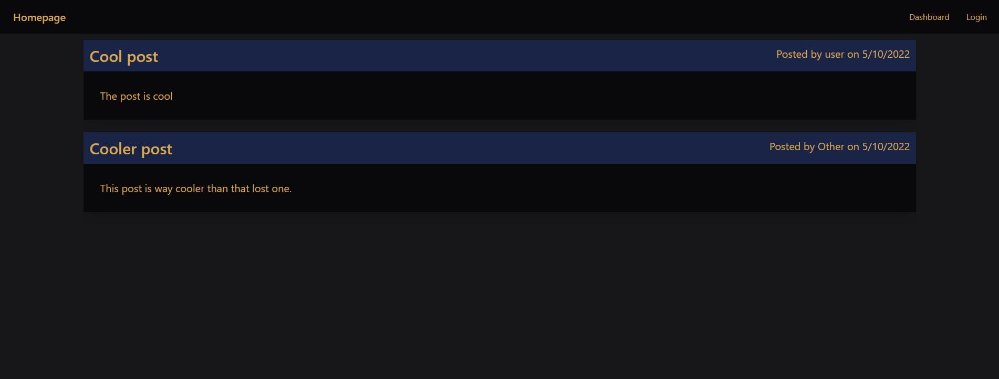
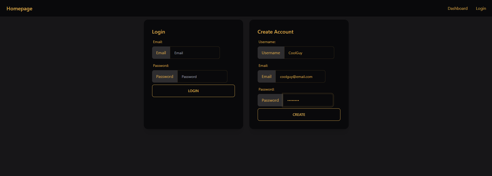
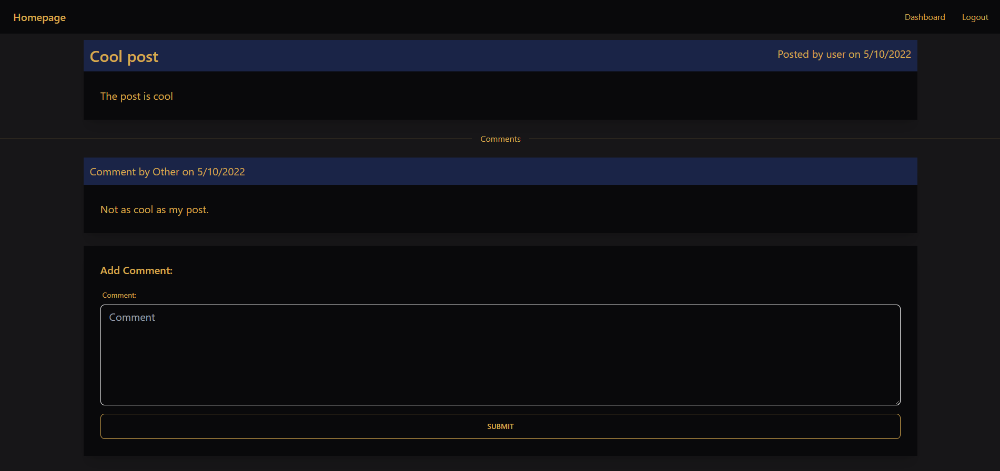
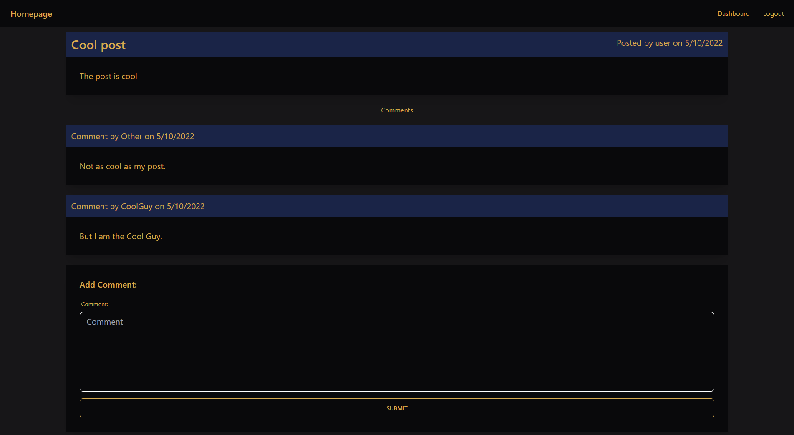
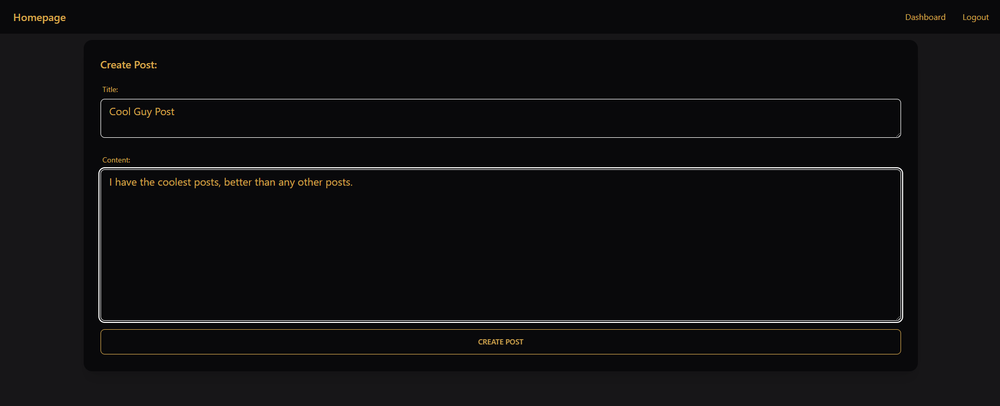
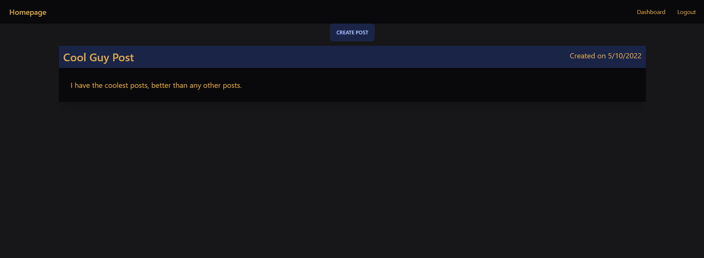
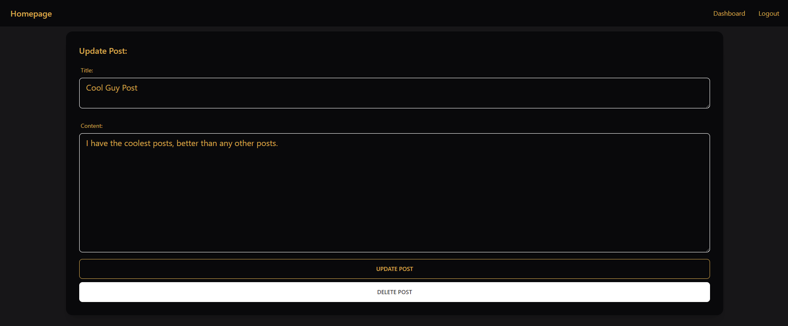

# Tech Blog

## Description

This website functions as a blog website. You will need to have an account in order to log in and interact with the website. The homepage will show you posts that are on the blog, even if you aren't logged in. From there everything else requires a login. You can click on posts to see comments, and add your own comment to the post. Upon clicking dashboard you will be shown your posts with a button that will take you to a page to create your own post. In your list of posts you can click on any post and edit the post, or delete the post. You will be kept logged in during a session but will need to log back in when you revisit the site in the future.

## Table of Contents

* [Link](#link)
* [Technologies](#technologies)
* [Installation](#installation)
* [Usage](#usage)
* [Questions](#questions)
* [License](#license)

## Link

https://safe-mountain-78939.herokuapp.com/

## Technologies

| Technology | Link |
| -------- | ------|
| HTML |   |
| CSS |   |
| Javascript |    |
| Tailwind | https://tailwindcss.com/ |
| DaisyUI | https://daisyui.com/ |
| Node.js | https://nodejs.org/en/ |
| npm | https://www.npmjs.com/ |
| mysql | https://www.mysql.com/ |
| mysql2 | https://www.npmjs.com/package/mysql2 |
| express | https://expressjs.com/ |
| sequelize | https://sequelize.org/ |
| dontenv | https://www.npmjs.com/package/dotenv |
| bcrypt | https://www.npmjs.com/package/bcrypt |
| express handlebars | https://www.npmjs.com/package/express-handlebars |
| express session | https://www.npmjs.com/package/express-session |
| connect session sequelize | https://www.npmjs.com/package/connect-session-sequelize |

## Installation

If you would like to run the server on your local machine then follow these steps. First clone the repository, run an npm install, open up mysql terminal and run source db/schema when you are in the root directory of the project. Now when you quit the mysql terminal you can optionally run the seeds for some default users, posts, and comments by typing in 'npm run seed' into the terminal. From there you can start the server by typing in 'npm start' into the terminal.

## Usage

When first opening the website you will be greeted by a page that will have any postss that are already in the database. If you are the first one on the site then the site may be empty. You can view these posts on the homepage but clicking on anything besides the homepage button in the top left will bring you to a login/sign up page. Here is an example homepage screen:  

  

From the login page you can sign up for an account by filling up the sign up fields, or if you already have an account you can enter your email and password to log in. Here is a user making an account:  

  

Upon creating an account or signing in you will be taken back to the homepage. You can view the posts on the homepage and click on any post to bring you to a view of the post as well as any comments the post has.  

  

You can leave a comment by filling in the comment box and hitting submit. Your comment would be added to the post like this:  

  

You can view your dashboard at any time by clicking the dashboard button in the navbar. This page will show any posts you have created as well as a create post button. Create a post here by clicking the button and filling in the title and content of the post, like so:  

  

From here it will be added to your dashboard like:  

  

You may click on this post to edit the post or delete the post, you will be brought to a page similar to the create a post page but with different buttons and the title and content sections already filled in. Here is editing the post:  

  

Upon deleting a post it will be gone forever, so be careful. When you want to log out just hit the log out button.

## Questions
If you have any questions you can reach me at:  
Github: cmwschroeder  
Github link: https://github.com/cmwschroeder  
Email: cmwschroeder@gmail.com

## License

Licensed under the [MIT License](LICENSE)